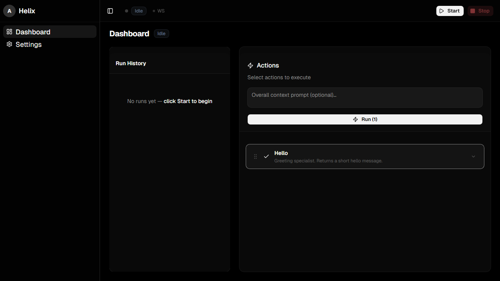

# Helix

<p align="center">
  
  
  
  
  
</p>

<p align="center">
  <strong>Production-ready starter kit for building autonomous AI agents with a real-time observability dashboard.</strong>
</p>

<p align="center">
  <a href="#quick-start">Quick Start</a> &bull;
  <a href="#features">Features</a> &bull;
  <a href="#architecture">Architecture</a> &bull;
  <a href="#adding-actions">Adding Actions</a> &bull;
  <a href="#memory">Memory</a>
</p>

---

<p align="center">
  
</p>

## Why Helix?

Most agent frameworks leave you staring at a terminal, guessing what your agent is doing. **Helix** gives you a beautiful, real-time dashboard to observe, control, and debug your Claude-powered agents as they run.

- **Action-based pipeline** — Compose agent workflows from discrete, reusable actions
- **Live observability** — WebSocket-powered dashboard with event timelines, tool calls, reasoning traces, and live logs
- **Shared SDK sessions** — Actions run in a single Claude Agent SDK session so each step has full context from prior steps
- **Production patterns built-in** — Error handling, persistence, structured logging, and graceful shutdowns
- **Optional long-term memory** — Vector-backed memory with Gemini embeddings (off by default)

---

## Quick Start

### Prerequisites

- Python 3.10+
- Node.js 18+
- [uv](https://docs.astral.sh/uv/) (Python package manager)
- A **Claude Code OAuth subscription** OR an Anthropic-compatible API key

> **No API key? No problem.** If you have a Claude Code subscription, Helix works out of the box — the Claude Agent SDK automatically uses your subscription. No `ANTHROPIC_API_KEY` required.

### Install & Run

```bash
# Clone the repo
git clone https://github.com/anand-92/helix.git
cd helix

# Install Python dependencies
uv sync

# Install frontend dependencies
npm --prefix frontend install

# Start both backend + frontend
./scripts/start-dev.sh
```

The dashboard opens at **`http://localhost:5173`**. The API runs at **`http://localhost:8000`**.

---

## Features

### Dashboard

- **Action selector** — Toggle actions on/off, reorder them, and set per-action prompts
- **Real-time runs** — Watch agents execute with live streaming via WebSocket
- **Run history** — Browse past runs with full event replay
- **Deep inspection** — Click any run to see agent messages, tool calls, thinking blocks, and errors
- **Dark mode** — OLED-black aesthetic with Framer Motion animations
- **MCP tool panel** — Visualize Model Context Protocol server interactions
- **Memory inspector** — View injected memory context when memory is enabled

### Backend

- **FastAPI control API** — `/actions`, `/runs/start`, `/runs/stop`, `/runs/status`, `/ws/runs/{id}`
- **Action registry** — Add new capabilities by dropping a Python file in `python/agents/`
- **Finalizer support** — Mark actions as `is_finalizer=True` to auto-reorder them to the end
- **Structured logging** — `structlog` with JSON output for production observability
- **Run persistence** — Every run is saved to `.runs/` as JSON for later analysis

### Memory Subsystem (Optional)

Memory is **disabled by default**. To enable:

1. Set `MEMORY_ENABLED=true` in `.env`
2. Set `GEMINI_API_KEY=<your-key>` in `.env`
3. Restart the backend

The memory DB and media directory are auto-created in `.memory/` on first use.

---

## Architecture

```
helix/
  frontend/           React 19 + Vite + TypeScript dashboard
    src/
      components/     UI components (shadcn/ui + Tailwind 4)
      pages/          Dashboard, Run Detail, Settings
      store/          Zustand state management
      hooks/          WebSocket + mobile detection hooks
      lib/            Agent tree, log parsing, highlight utilities
  python/             Python backend (FastAPI + Claude Agent SDK)
    agents/           Action definitions (one file per action)
    memory/           Persistent memory subsystem
    orchestrator.py   Core runtime — executes actions, emits events
    server.py         FastAPI control API + WebSocket
    config.py         All configuration
  .claude/
    skills/           Agent skills (find-skills included)
    output-styles/    Output style presets
  scripts/
    start-dev.sh      One-command dev server launcher
```

---

## Adding Actions

Adding a new agent capability takes three steps:

1. **Create the action** — `python/agents/action_myfeature.py`

```python
from claude_agent_sdk import AgentDefinition

MY_FEATURE = AgentDefinition(
    name="my_feature",
    prompt="You are a specialized agent that...",
    tools=["Read", "Write", "Grep"],
)
```

2. **Export it** — `python/agents/__init__.py`

```python
from .action_myfeature import MY_FEATURE

__all__ = ["HELLO_ACTION", "MY_FEATURE"]
```

3. **Register it** — `python/orchestrator.py`

```python
from agents import HELLO_ACTION, MY_FEATURE

class PipelineOrchestrator:
    def _register_actions(self) -> None:
        self._registry.register(HELLO_ACTION)
        self._registry.register(MY_FEATURE)
```

Then reload the dashboard and your new action appears as a toggleable card.

---

## Tech Stack

| Layer | Technology |
|-------|-----------|
| Agent Runtime | Claude Agent SDK (Python) |
| Backend API | FastAPI + Uvicorn |
| Frontend | React 19 + Vite + TypeScript |
| Styling | Tailwind CSS 4 + shadcn/ui |
| State | Zustand |
| Animations | Framer Motion |
| Code Highlight | Shiki |
| Icons | Lucide React |
| Package Manager | uv (Python), npm (Node) |

---

## Authentication & Model Providers

Helix uses the Claude Agent SDK under the hood, which supports multiple authentication methods:

### Option 1: Claude Code OAuth (default, no setup)

If you have an active **Claude Code subscription**, the SDK will automatically authenticate via OAuth. No API keys, no `.env` edits. Just run it.

### Option 2: Anthropic API key

Set `ANTHROPIC_API_KEY` in your `.env` file to use a direct Anthropic API key instead of OAuth.

### Option 3: Any Anthropic-compatible endpoint

You can point the SDK at any provider that implements the Anthropic API format. Copy one of the example configs below into `.claude/settings.json`:

**MiniMax**
```json
{
  "env": {
    "ANTHROPIC_BASE_URL": "https://api.minimax.io/anthropic",
    "ANTHROPIC_AUTH_TOKEN": "<YOUR_MINIMAX_KEY>",
    "ANTHROPIC_MODEL": "MiniMax-M2.7",
    "ANTHROPIC_DEFAULT_SONNET_MODEL": "MiniMax-M2.7",
    "ANTHROPIC_DEFAULT_OPUS_MODEL": "MiniMax-M2.7",
    "ANTHROPIC_DEFAULT_HAIKU_MODEL": "MiniMax-M2.7"
  }
}
```

> **Note:** The Claude Agent SDK respects `ANTHROPIC_BASE_URL` and `ANTHROPIC_AUTH_TOKEN` from `.claude/settings.json`. Any provider with an Anthropic-compatible API (MiniMax, GLM, local proxies, etc.) works the same way — just swap the base URL and token.

---

## Environment Variables

Copy `.env.example` to `.env` and configure:

| Variable | Description | Required |
|----------|-------------|----------|
| `ANTHROPIC_API_KEY` | Anthropic API key (only if not using OAuth) | No |
| `MEMORY_ENABLED` | Enable persistent memory | No (default: `false`) |
| `GEMINI_API_KEY` | Gemini API key for memory embeddings | Only if memory enabled |

---

## Scripts

```bash
# Start dev servers (backend + frontend)
./scripts/start-dev.sh

# Backend only
uv run python python/server.py

# Frontend only
npm --prefix frontend run dev

# Run actions via CLI
uv run python python/main.py --actions hello
uv run python python/main.py --actions hello --prompt "Build a todo app"

# Lint & format
npm --prefix frontend run lint
uv run ruff check python
uv run ruff format python
```

---

## License

MIT

---

<p align="center">
  Built with the <a href="https://docs.anthropic.com/en/agents-and-tools/claude-agent-sdk">Claude Agent SDK</a>
</p>
